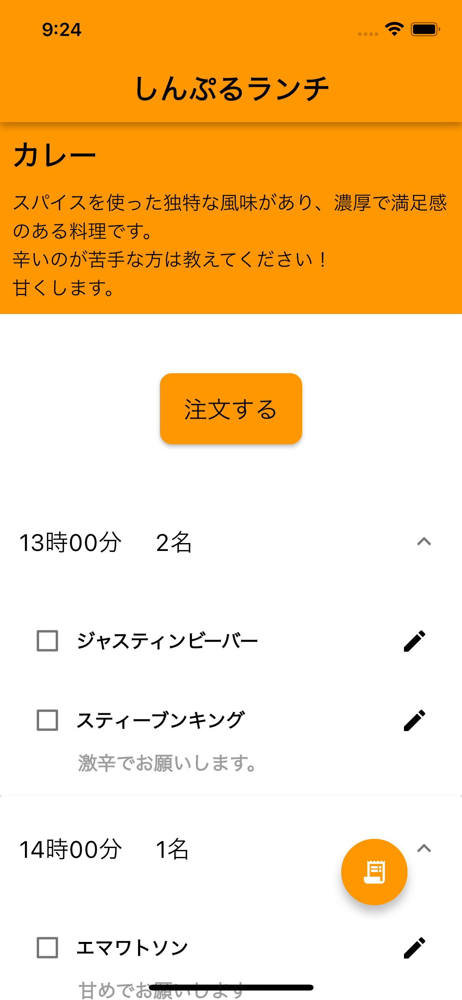
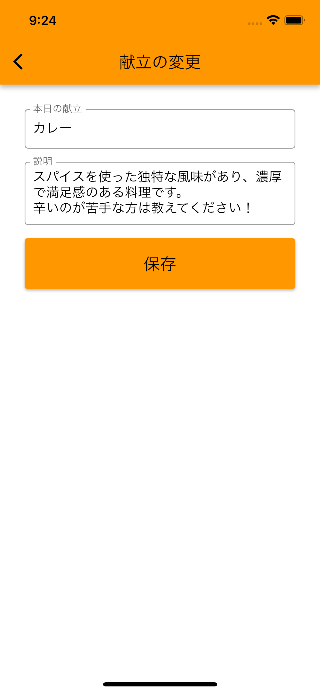
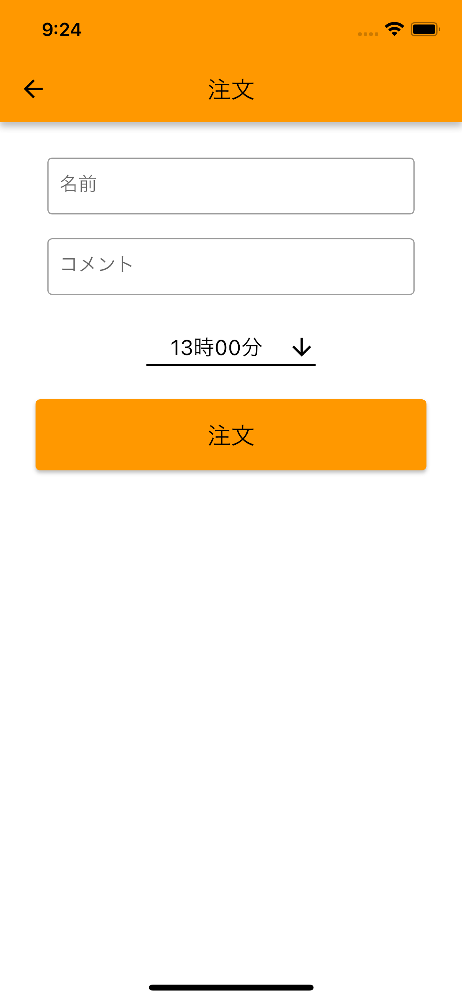
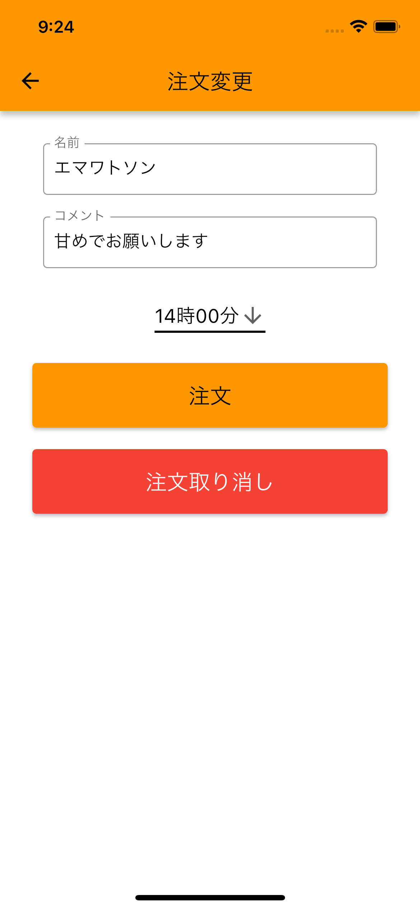
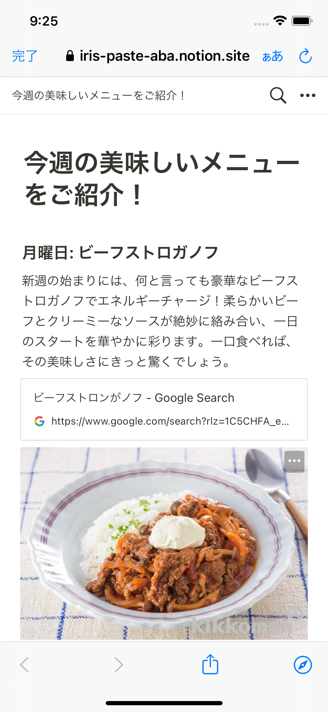

# Simple Lunch

<div style="display: flex;">
    
    
    
    
    
    
</div>

## プロジェクトの概要

Simple Lunch は、インターン先のランチ参加者を管理するためのアプリケーションです。ランチの注文や好みの管理を効率化し、関係者全員の手間を省くことを目指しています。

## ディレクトリ構成

```
simple_lunch/
├── lib/
│   ├── main.dart
│   ├── firebase_options.dart
│   ├── constants.dart
│   ├── services/
│   │   ├── preferences_service.dart
│   │   ├── order_loader.dart
│   │   └── menu_service.dart
│   └── screens/
│       ├── order.dart
│       ├── home.dart
│       ├── edit_order.dart
│       └── edit_menu.dart
└── README.md
```

## インストールと使用方法

プロジェクトのセットアップと使用方法は以下の手順に従ってください：

1. リポジトリをクローンします：git clone https://github.com/shinnkura/simple_lunch.git
2. プロジェクトディレクトリに移動します：cd simple_lunch
3. 必要な依存関係をインストールします：flutter pub get
4. プロジェクトを実行します：flutter run

## 依存関係

このプロジェクトは、以下のライブラリとツールに依存しています：

- Flutter：アプリケーションを構築するための UI ツールキット。
- Firebase：認証やデータベース管理などのバックエンドサービスに使用されます。
- Shared Preferences：デバイス上でユーザーデータを持続させるために使用されます。

## ドキュメンテーション

プロジェクトに関する詳細な情報は、プロジェクトのドキュメンテーションを参照してください。

## 貢献ガイドライン

プロジェクトへの貢献は歓迎されています。バグを見つけたり、新しい機能を思いついたりした場合は、遠慮なく問題を開いたり、プルリクエストを提出してください。コードがプロジェクトのスタイルガイドに従っており、すべてのテストが通ることを確認してから変更を提出してください。

## ライセンス情報

このプロジェクトは MIT ライセンスの下でライセンスされています。詳細については、LICENSE ファイルを参照してください。

## 連絡先情報

質問やフィードバックがある場合は、GitHub の Issue を通じてご連絡ください。
